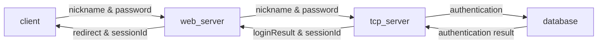
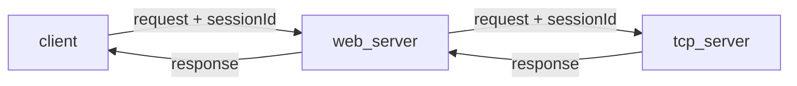

# Fresh Guy Entry Task

Deng Kaisheng


## Requirements

[guide](https://confluence.shopee.io/display/SPDEV/Fresh+Guy+Entry+Task)


## Features


* Web server - TCP server architecture ✅

* Self-design protocol between web server and tcp server ✅

* Password hashing ✅

* File upload/edit (picture) ✅

* User login/logout/edit ✅

* MySQL connection pool ✅
* Nickname utf-8 encoding support ✅

* Redis cache ✅


## Implementation


### overall architecture


### database schema 

The design of the database table is according to the following guide,

[MySQL Database Design Guide](https://confluence.shopee.io/display/LABS/MySQL+Database+Design+Guide)


There are 4 fields in total, with `id bigint unsigned` as primary key.

```sql
create table if not exists user_tab (
    id bigint unsigned auto_increment,
    user_nickname varchar(128) unique not null,
    user_password varchar(128) not null,
    profile_photo_path varchar(128),

    primary key (`id`)
);
```


### communication protocol design


### file upload/edit

The file upload/edit process is similar to command http requests, the differences are as follows,


When user uploads a file, **the web server will create a temp file in local directory, and send the path of the temp file to TCP server**.

The TCP server will update the database to store the path of the temp file in the table, and reply to the web server.

Upon receiving reply from TCP server, the web server will save the temp file's path to Redis cache.

Next time when client asks for the path of the picture, the web server first looks for it in the Redis cache, if found, respond directly, if not, it sends request to the TCP server through socket, and TCP server fetch it from the database and return to web server, which returns to the client.


The editing process is similar, with an additional process to update the Redis cache.


### session


Session is used to identify different users after user logged in. In this project, I **use the primary key of the database as session id**, regardless of security problems.


The process is as follows,


For login request,



And session id will be stored at client side.

For all the requests afterwards, the session id will be added to the request packet body,



The TCP server uses the session id to identify which user is sending requests, if needed.


